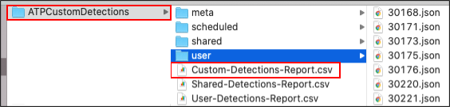
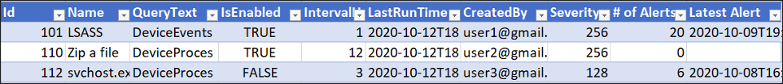
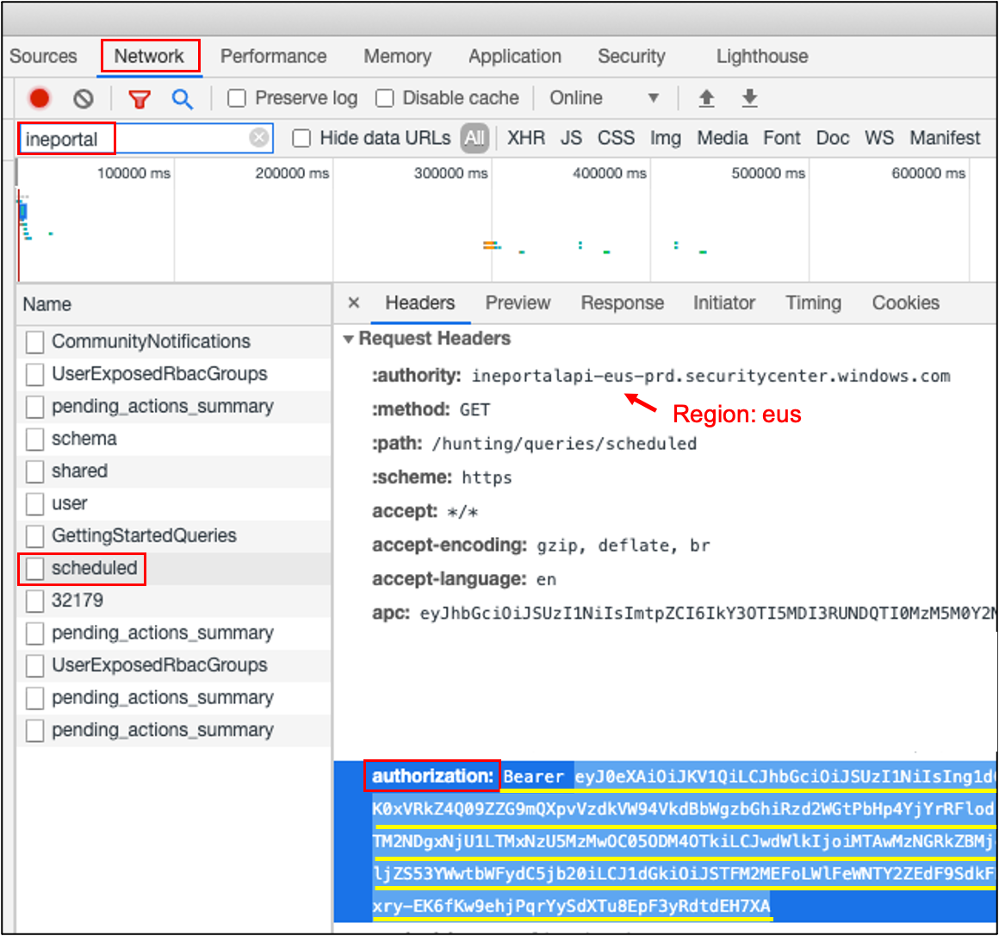

# Export-ATPCustomDetections
This cross-platform PowerShell script will download all ATP detections you have access to including scheduled (custom), shared and user (personal) queries.

## Example Output

By default, all output is written to the `ATPCustomDetections` folder on the Desktop. The output folder will contain the following folder structure.



The raw data is found in multipe json files. The "scheduled" folder contains the raw data for the Custom Detections, the "shared" folder contains the raw data for all queries in the Shared Queries section, and the "user" folder contains the raw data for your own personal queries.

The easiest way to view this data is in the rolled up CSV reports. The CSV reports gather the most relevant data from the raw data and include it for easy importing into Excel. Use the "format as table" option in Excel to make the report more readable. The Custom-Detections-Report is shown below.



The Shared and User reports have less data because they are not scheduled queries and do not have associated alerts. The Custom Detections Report includes, but is not limited to, the following helpful fields.

* **Name**
  * Name of saved query
* **QueryText**
  * The actual text of the query, in muli-line form
* **IsEnabled**
  * A value of TRUE indicates that the detection is enabled
* **IntervalHours**
  * The number of hours between automated runs of the query
* **CreatedBy**
  * The original author of the query
* **Severity**
  * High (256), Medium (128), Low (64), Info (32)
* **# of Alerts**
  * Number of alerts fired in the last 30 days (or 100 max)
* **Latest Alert**
  * The most recent alert from this custom detection.

## Setup Instructions

You must provide your authorization token in a file called `bearerToken.txt` in the same folder as the `Export-ATPCustomDetections.ps1` file.

You can find your bearer token by using the developer tools in the browser where you are logged into ATP with the Advanded Hunting page loaded. Now right click and select "inspect" to bring up the developer tools. Click on the "Network" tab and then refresh the Advanced hunting page. Filter the requests down to those going to "ineportal", click on "scheduled" and find the "authorization" header as shown.



Copy everything starting from `Bearer` through the end of the token (shown in light blue) and paste in a file called `bearerToken.txt` in the same folder as the `Export-ATPCustomDetections.ps1` script.

## Usage Examples

Import and run the module. Output will be written to a folder on your desktop called `ATPCustomDetections`.

```powershell
Import-Module ./Export-ATPCustomDetections.ps1
Export-ATPCustomDetections
```

Specify your own output folder and file containing your authorization token.

```powershell
Export-ATPCustomDetections -OutputFolder C:\ATP -BearerTokenFile C:\Users\art\myToken.txt
```

Force re-download of query data to pick up any changes that have been made to the queries, rules or associated alerts. If you don't specify overwriting the script will only download new detections, rules, and alerts but will not update any that were previously downloaded.

```powershell
Export-ATPCustomDetections -Overwrite
```

Specify your security center endpoint region, (e.g. eus, cus, neu). See the image in the Setup section for information on identifying your region.

```powershell
Export-ATPCustomDetections -Region cus
```